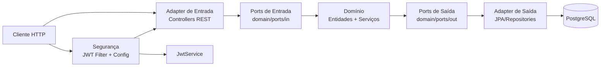
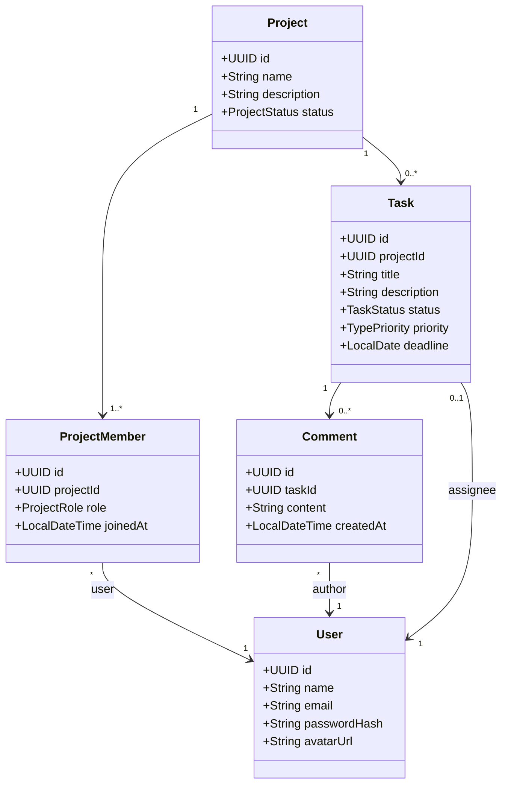
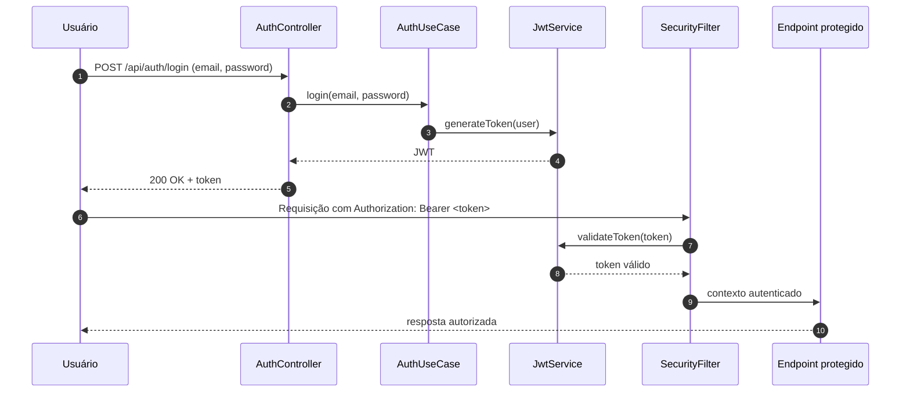

# TaskFlow API


API REST para gestão de projetos e tarefas com autenticação JWT, construída em Arquitetura Hexagonal (Ports & Adapters).

## Sumário

- [Descrição e objetivos do projeto](#descrição-e-objetivos-do-projeto)
- [Visão arquitetural](#visão-arquitetural)
- [Estrutura de diretórios](#estrutura-de-diretórios)
- [Stack e referências de tecnologias](#stack-e-referências-de-tecnologias)
- [Como rodar localmente](#como-rodar-localmente)
  - [Pré-requisitos](#pré-requisitos)
  - [Execução sem Docker](#execução-sem-docker)
  - [Execução com Docker Compose](#execução-com-docker-compose)
- [Documentação de variáveis de ambiente](#documentação-de-variáveis-de-ambiente)
- [Documentação da API](#documentação-da-api)
- [Endpoints por controller](#endpoints-por-controller)

## Descrição e objetivos do projeto

O TaskFlow centraliza o fluxo de trabalho de times por meio de uma API com foco em:

- autenticação e cadastro de usuários;
- gestão de projetos e membros por papéis (`OWNER`, `MEMBER`, `VIEWER`);
- criação, priorização, atribuição e evolução de tarefas;
- comentários em tarefas com regras de autorização;
- organização de regras de domínio separadas de infraestrutura.

## Visão arquitetural

A aplicação adota **Arquitetura Hexagonal (Ports & Adapters)** para desacoplar regras de negócio do transporte HTTP e da persistência.

### Diagrama da arquitetura geral (hexagonal)



### Explicação rápida

- **Domínio**: concentra regras, entidades e casos de uso.
- **Ports**: contratos do que entra (use cases) e do que sai (repositórios/integrações).
- **Adapters**: implementações concretas para web, segurança e persistência.
- **Infraestrutura**: detalhes técnicos (Spring MVC, JPA, PostgreSQL, JWT).

### Diagrama de entidades do domínio



### Diagrama do fluxo de autenticação JWT



## Estrutura de diretórios

```text
src
├── main
│   ├── java/kaua/felix/taskflow
│   │   ├── domain
│   │   │   ├── entity
│   │   │   ├── ports
│   │   │   │   ├── in
│   │   │   │   └── out
│   │   │   ├── service
│   │   │   └── shared
│   │   └── infra
│   │       ├── config
│   │       ├── persistence
│   │       ├── security
│   │       └── web
│   └── resources
└── test/java
```

## Stack e referências de tecnologias

- **Java 21** — https://docs.oracle.com/en/java/javase/21/
- **Spring Boot 4** — https://docs.spring.io/spring-boot/
- **Spring Security + JWT (jjwt)** — https://docs.spring.io/spring-security/ e https://github.com/jwtk/jjwt
- **Spring Data JPA / Hibernate** — https://docs.spring.io/spring-data/jpa/reference/ e https://hibernate.org/orm/documentation/
- **PostgreSQL 16** — https://www.postgresql.org/docs/
- **Docker / Docker Compose** — https://docs.docker.com/
- **OpenAPI (springdoc)** — https://springdoc.org/
- **Maven Wrapper** — https://maven.apache.org/wrapper/

## Como rodar localmente

### Pré-requisitos

- JDK 21 instalado e configurado no `JAVA_HOME`
- Docker e Docker Compose (para banco e execução containerizada)
- Shell com permissão para executar `mvnw` (Linux/macOS)

### Execução sem Docker

1. Suba somente o PostgreSQL com Docker Compose:

```bash
docker compose up -d db
```

2. Crie o arquivo `.env` na raiz (copie e ajuste os valores):

```bash
cp .env.example .env
```

3. Inicie a aplicação:

```bash
./mvnw spring-boot:run
```

Se necessário (Linux/macOS):

```bash
chmod +x mvnw
./mvnw spring-boot:run
```

Alternativa sem alterar permissão:

```bash
sh mvnw spring-boot:run
```

### Execução com Docker Compose

1. Crie o arquivo `.env.docker` (modelo abaixo) com `DB_URL` apontando para o serviço `db`.

2. Suba toda a stack:

```bash
docker compose up --build
```

3. Para parar os serviços:

```bash
docker compose down
```

## Documentação de variáveis de ambiente

A aplicação usa as variáveis abaixo em `src/main/resources/application.properties`.

### Modelo `.env` (execução local)

```env
DB_URL=jdbc:postgresql://localhost:5432/taskflow
DB_USERNAME=postgres
DB_PASSWORD=postgres
JWT_SECRET=troque_esta_chave_por_uma_string_segura_com_32_ou_mais_caracteres
JWT_EXPIRATION=3600000
```

### Modelo `.env.docker` (execução com Compose)

```env
DB_URL=jdbc:postgresql://db:5432/taskflow
DB_USERNAME=postgres
DB_PASSWORD=postgres
JWT_SECRET=troque_esta_chave_por_uma_string_segura_com_32_ou_mais_caracteres
JWT_EXPIRATION=3600000
```

### Referência rápida

- `DB_URL`: URL JDBC do PostgreSQL.
- `DB_USERNAME`: usuário do banco.
- `DB_PASSWORD`: senha do banco.
- `JWT_SECRET`: segredo para assinatura do token (mínimo recomendado: 32 caracteres).
- `JWT_EXPIRATION`: tempo de expiração do token em milissegundos.

## Documentação da API

- Swagger UI: http://localhost:8080/swagger-ui.html
- OpenAPI JSON: http://localhost:8080/v3/api-docs

## Endpoints por controller

> Rotas abaixo refletem os controllers atuais. Endpoints autenticados exigem `Authorization: Bearer <token>`.

### AuthController (`/api/auth`)

- `POST /login`
  - Body: `email`, `password`
- `POST /register`
  - Body: `name`, `email`, `password`

### UserController (`/api/users`)

- `GET /me`
- `PUT /me`
  - Body: `name` (obrigatório), `avatarUrl`
- `PUT /me/password`
  - Body: `oldPassword`, `newPassword` (mín. 6 chars)

### ProjectController (`/api/projects`)

- `POST /`
  - Body: `name` (obrigatório), `description`
- `GET /`
  - Query params: `page` (padrão `0`), `size` (padrão `10`)
- `GET /{id}`
  - Path param: `id` (`UUID`)
- `PUT /{id}`
  - Path param: `id` (`UUID`)
  - Body: `name` (obrigatório), `description`
- `PATCH /{id}/archive`
  - Path param: `id` (`UUID`)
- `POST /{id}/members`
  - Path param: `id` (`UUID`)
  - Body: `email`, `role` (`OWNER` | `MEMBER` | `VIEWER`)
- `DELETE /{id}/members`
  - Path param: `id` (`UUID`)
  - Body: `email`
- `GET /{projectId}/tasks`
  - Path param: `projectId` (`UUID`)
  - Query params: `page` (padrão `0`), `size` (padrão `10`), `status`, `priority`, `deadline` (`YYYY-MM-DD`)
- `POST /{projectId}/tasks`
  - Path param: `projectId` (`UUID`)
  - Body: `title` (obrigatório), `description`, `priority` (obrigatório), `deadline`, `assigneeId`

### TaskController (`/api/tasks`)

- `GET /{id}`
  - Path param: `id` (`UUID`)
- `PUT /{id}`
  - Path param: `id` (`UUID`)
  - Body: `title` (obrigatório), `description`, `priority` (obrigatório), `deadline` (obrigatório)
- `PATCH /{id}/status`
  - Path param: `id` (`UUID`)
  - Body: `status`
- `PATCH /{id}/assign`
  - Path param: `id` (`UUID`)
  - Body: `email`
- `DELETE /{id}`
  - Path param: `id` (`UUID`)
- `POST /{id}/comments`
  - Path param: `id` (`UUID`)
  - Body: `content`
- `DELETE /{id}/comments/{commentId}`
  - Path params: `id`, `commentId` (`UUID`)
